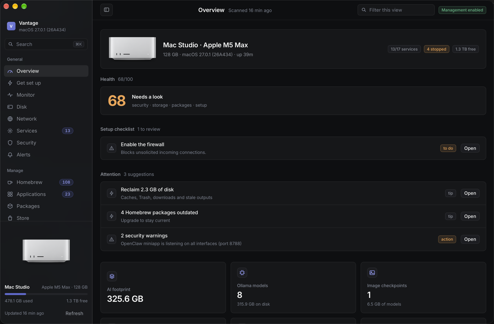
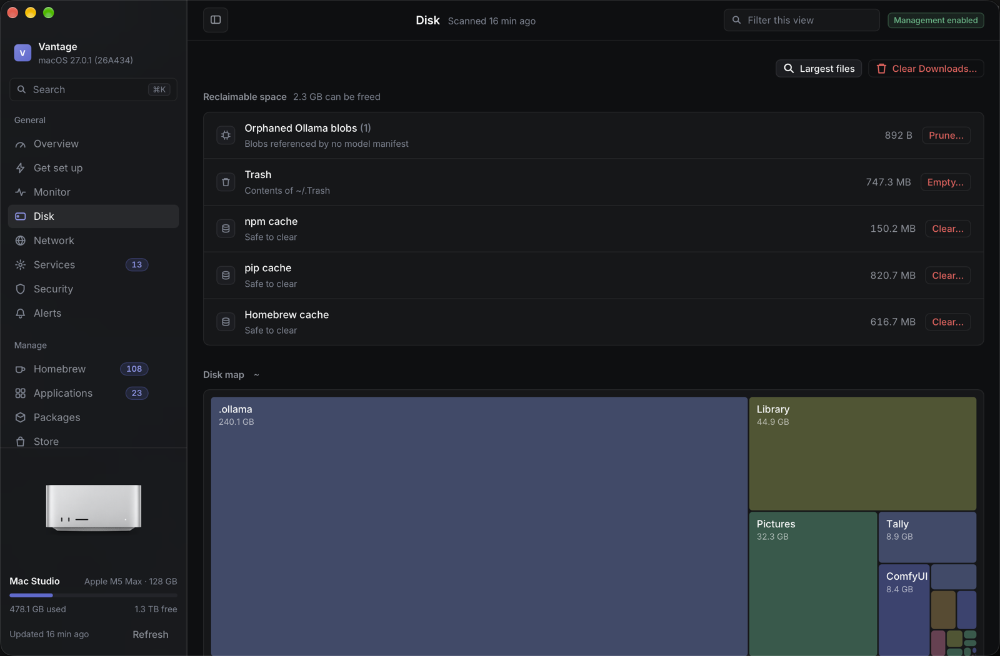
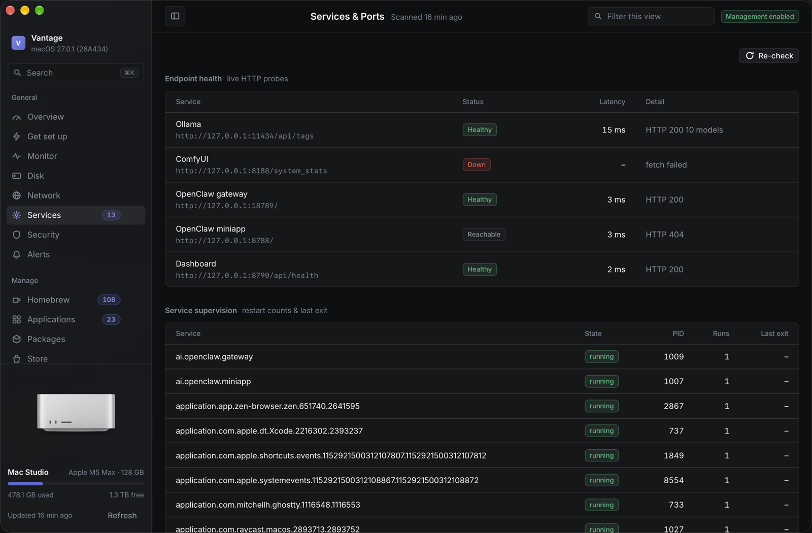
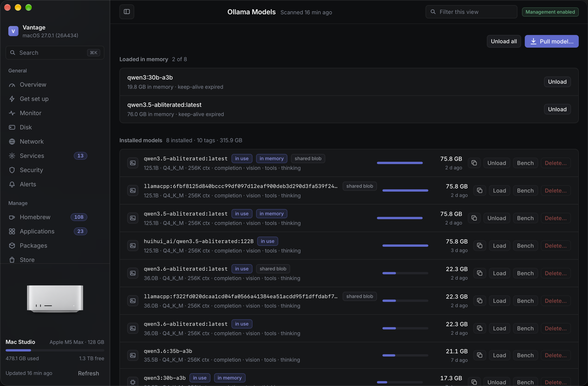
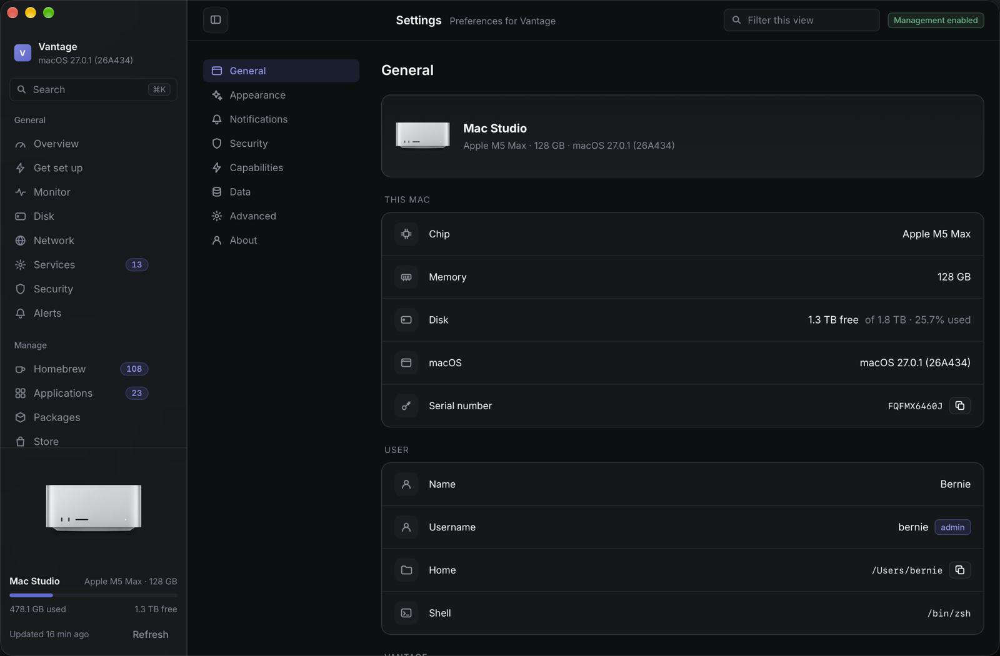

<div align="center">


# Vantage

**Total management for your Mac.**

Apps, storage, services, network, security, monitoring and your local AI stack,
from one fast console.

Loopback-only · zero dependencies · nothing leaves your machine.

</div>



## Highlights

- **Everything in one place.** Apps, disk & reclaim, services & logs, network, security posture, Homebrew & packages, and your local AI models and runtimes.
- **Fast and local.** A single dependency-free Node process on `127.0.0.1:8790`, guarded by a per-run token. No cloud, no accounts, no telemetry.
- **Real management, safely.** Fixed binaries and validated arguments (never arbitrary shell), Trash-based deletes, and confirmations for destructive actions.
- **Touch ID gate.** Protect irreversible actions with your fingerprint, verified on the server (WebAuthn in the browser, a Touch ID-gated key in the Mac app).
- **Onboarding that sets up your Mac.** Detects your stack, configures appearance, and walks permissions with one-click System Settings deep links.
- **Web app or native Mac app.** Same dashboard either way; the native shell adds a Dock icon, menu-bar actions and native notifications.

## Views

| Disk | Services |
|---|---|
|  |  |

| Models | Settings |
|---|---|
|  |  |

Plus **Overview** (health, attention items, quick actions), **Monitor** (live CPU,
memory, disk and network charts), **Network** (throughput, connections, ping/port
diagnostics), **Security** (exposure, posture, tunnels), **Applications**,
**Packages**, **Homebrew**, **Store**, **Agent Stack**, and **Activity**.

## Install

One command on any Mac (macOS 13+, Node 20+):

```sh
git clone <your-repo-url> ~/Projects/vantage && ~/Projects/vantage/install.sh
```

`install.sh` checks Node, pulls the code, starts Vantage as a **login service**
(`local.vantage`), builds the native app when Xcode tools are present, and opens
the dashboard. Re-run the same command any time to update, or use the wrapper:

```sh
~/Projects/vantage/update.sh
```

Flags: `--native`, `--no-native`, `--uninstall`. Override the location or port
with `VANTAGE_DIR` / `PORT`.

## Settings & onboarding

Vantage opens with a **first-run wizard**: welcome → your Mac → your stack →
appearance → alerts → Touch ID → get-the-app → finish setup. It is skippable,
resumable, and re-runnable from Settings → About.

**Settings** is a full surface of its own (sidebar, `⌘,`) covering General,
Appearance (with a live preview), Notifications, Security, Capabilities, Data,
Advanced and About. Every row shows its state and either fixes itself or opens
the exact System Settings pane.

## Notifications

- **Desktop & Web Push** banners from your browser, while Vantage is open or in the background.
- **macOS banners** posted by the server through `terminal-notifier`.
- **Telegram** messages to your chat.

## Web app vs native Mac app

Both run the same dashboard on the same local server.

- **Web app / PWA**: installs to the Dock with full browser APIs (Touch ID, Web Push, save-to-file, screen capture).
- **Native Mac app** (`native/`): a WKWebView shell with a menu-bar extra (Rescan · Clean up · Open Monitor) and a JS↔native bridge for native notifications, save/open dialogs, clipboard, screen wake lock, Dock badge and a Touch ID-gated signing key.

## Interface

Linear-inspired, dark-first, keyboard-driven.

- **⌘K** command palette · **/** filter · **r** rescan · **g** then `o/m/d/s/a` to jump · **?** shortcuts
- Inline busy / success / error on every action, side panels for detail, and tracked jobs with live logs.

## API

| Method | Path | Purpose |
| --- | --- | --- |
| `GET` | `/api/health` | Liveness |
| `GET` | `/api/session` | Token + read-only flag |
| `GET`/`POST` | `/api/inventory` · `/api/scan` | Inventory / rescan |
| `GET`/`POST` | `/api/actions` · `/api/actions/:id` | Management actions |
| `GET` | `/api/jobs` · `/api/jobs/:id?cursor=` | Job status/output |
| `GET` | `/api/metrics/live` · `/api/metrics/series?minutes=` | Metrics |
| `GET` | `/api/disk/tree?path=` · `/api/reclaim` | Disk tree / reclaimable |
| `GET` | `/api/health/checks` · `/api/logs` · `/api/logs/tail` | Health & logs |
| `GET` | `/api/security` · `/api/network` · `/api/network/ping` · `/api/network/port` | Security & network |
| `GET`/`POST` | `/api/notify` · `/api/notify/test` | Notification settings |
| `GET`/`POST` | `/api/webauthn/*` | Touch ID: status, register, assert, native key |
| `GET`/`POST` | `/api/push/*` | Web Push subscribe / status / test |
| `GET`/`PATCH` | `/api/settings` | Aggregated settings |
| `POST` | `/api/settings/{export,import,reset}` · `/api/upload` | Backup / restore / ingest |
| `GET`/`POST` | `/api/onboarding` · `/api/setup` | First-run state & diagnostics |

## Layout

```
server.js            HTTP server, routes, scan lifecycle, cache
install.sh           one-command installer / updater
update.sh            convenience wrapper
lib/                 scanner, metrics, disk, health, security, notify, agent,
                     network, settings, onboarding, webauthn, push, setup, ...
public/              dashboard UI (vanilla JS, no build step)
public/manifest.webmanifest, public/sw.js   PWA + offline shell
native/              WKWebView Mac app shell + bridge (build.sh)
data/                inventory.json, metrics.db, settings (generated, gitignored)
```

## Safety model

- Loopback-only; a per-run token is required for every mutation; cross-origin is rejected.
- No arbitrary shell. Fixed binaries with validated arguments only.
- Deletion goes to the Trash where possible; blob pruning is explicit and confirmed.
- Destructive actions require confirmation; optional Touch ID for irreversible ones.
- `READ_ONLY=1 npm start` disables all management.

## Configuration

| Variable | Default | Meaning |
| --- | --- | --- |
| `PORT` | `8790` | HTTP port |
| `HOST` | `127.0.0.1` | Bind address |
| `READ_ONLY` | `0` | `1` disables management |
| `OLLAMA_HOST` | `http://127.0.0.1:11434` | Ollama API |

## License

MIT.
